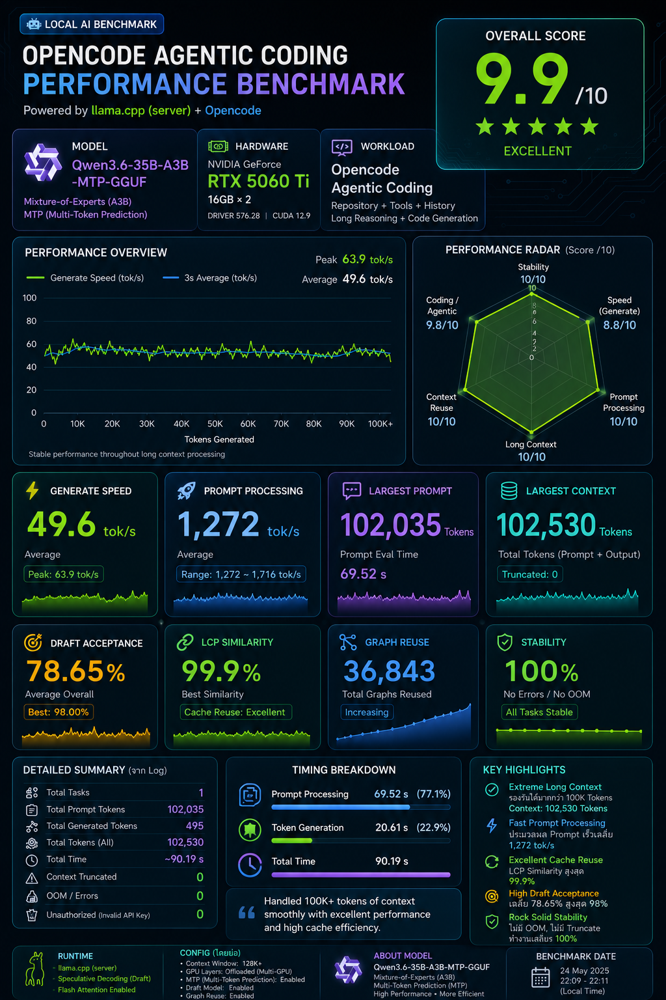
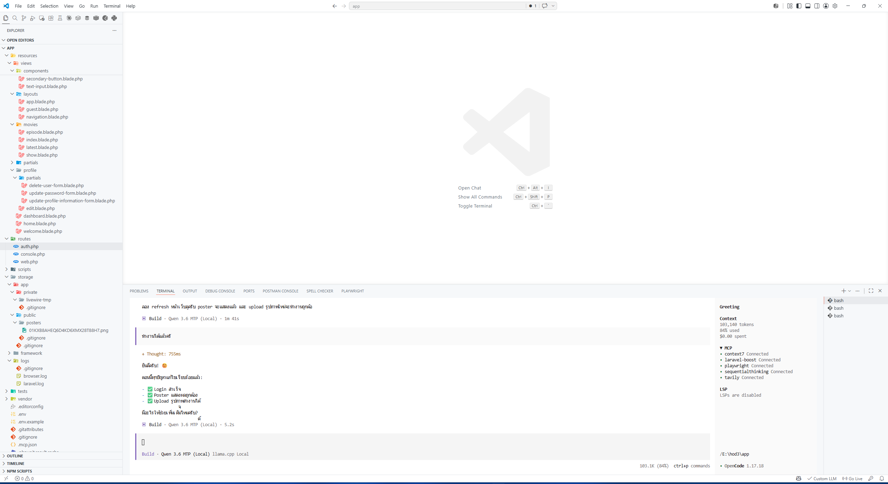
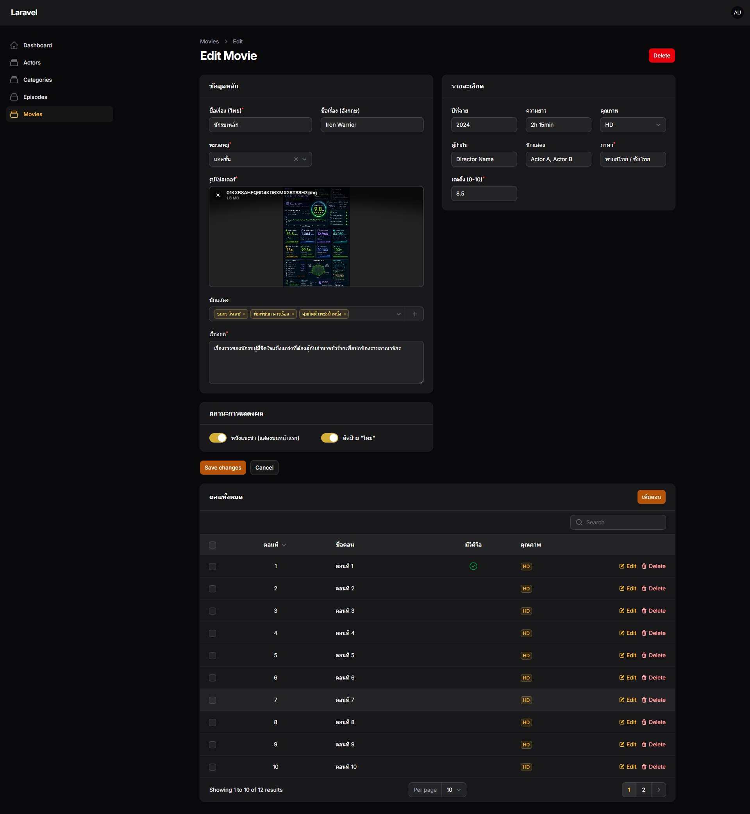
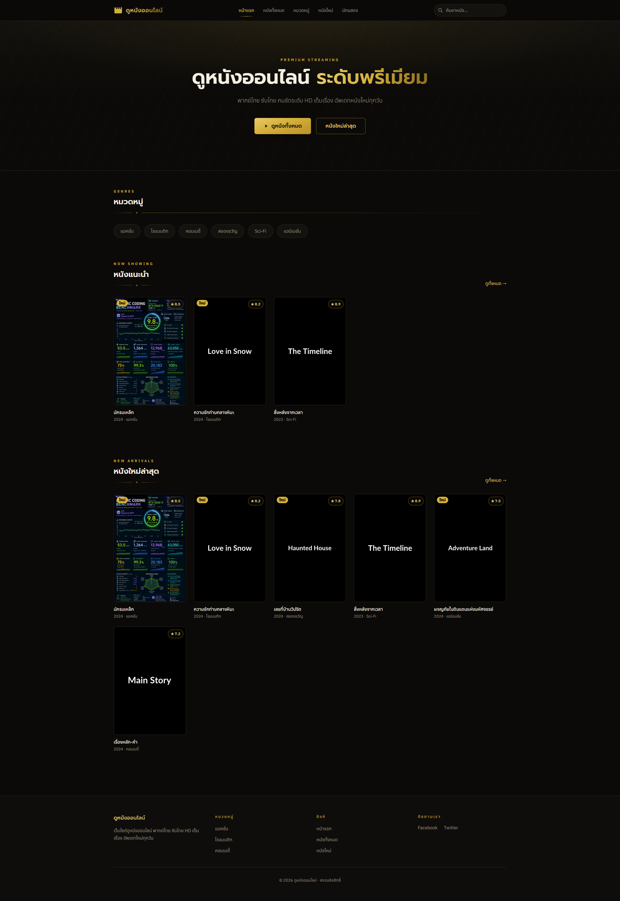
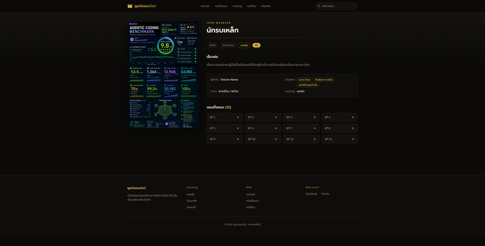

# Llama Controller

A local control panel for `llama-server.exe` (llama.cpp) so you don't have to
open a terminal and retype the launch command every time. One always-on
background "control server" manages the actual model process; you talk to it
via a CLI command (`llama ...`), a web dashboard, or a system tray icon.

This copy is tuned specifically for **agentic coding** (opencode, Zed, Cline,
GitHub Copilot Chat, Open WebUI) against a local Qwen3.6-35B-A3B model on
2x RTX 5060 Ti (16GB each). Claude Code is deliberately not wired up — see
below.

Dashboard icon (`public/icon-dark.svg`) is the official llama.cpp mark from
[ggml-org/llama.brand](https://github.com/ggml-org/llama.brand), licensed
CC BY-NC 4.0 — used here under attribution, non-commercial personal project.

## In action

Benchmark run through opencode against this exact tuned setup:



**9.9/10 overall** — 49.6 tok/s average generate speed (peak 63.9), 78.65%
average MTP draft acceptance, 99.9% cache/LCP similarity, **100% stability**
(zero OOM, zero errors) across a 102,530-token session with no context
truncation.

A real project built end-to-end through opencode in VS Code against this
model — a Laravel movie-streaming site (admin panel + public frontend):



<table>
<tr>
<td></td>
<td></td>
<td></td>
</tr>
<tr>
<td align="center">Admin backend</td>
<td align="center">Public homepage</td>
<td align="center">Movie detail page</td>
</tr>
</table>

## Layout

- `config.json` — model profiles (path, port, context size, GPU layers, sampling, etc.)
- `server.js` + `lib/` — the control server (Node, no npm install needed). Runs
  on `http://0.0.0.0:4570`. Starts/stops/restarts `llama-server.exe`, tails its
  log, and reports GPU usage.
- `public/` — the web dashboard served by the control server.
- `cli/llama.ps1` / `cli/llama.cmd` — the `llama` command. Auto-starts the
  control server if it isn't already running.
- `tray/tray.ps1` — system tray icon (Start/Stop/Restart/Open, per-profile menu).
- `scripts/install.ps1` — adds `cli\` to your PATH and makes the tray icon
  launch automatically at login.

## Everyday commands (from any cmd.exe or PowerShell window)

```
llama start [profile]     start a model (defaults to config.json's defaultProfile)
llama stop                stop whatever is running
llama restart [profile]   stop + start (same profile if none given)
llama status              running? which profile/pid/port, GPU usage
llama logs [n]            last n lines of the current model's log (default 100)
llama profiles            list configured profiles
llama open                open the web dashboard in your browser
```

The first call to any `llama` command auto-starts the control server (hidden,
no console window) if it isn't already running. Web dashboard:
`llama open`, or browse to `http://localhost:4570`. Tray icon: right-click for
Start/Stop/Restart/Open; starts automatically after `scripts\install.ps1`, or
run manually with `powershell -WindowStyle Hidden -File tray\tray.ps1`.

---

## The model: Qwen3.6-35B-A3B-MTP

Read directly from the GGUF header and cross-checked against the
[official Unsloth model card](https://huggingface.co/unsloth/Qwen3.6-35B-A3B-MTP-GGUF):

- **Architecture**: hybrid — 10 blocks of `3x (Gated DeltaNet -> MoE) + 1x (Gated Attention -> MoE)`,
  i.e. only 1 layer in 4 is full attention; the rest is Gated DeltaNet, a
  linear-attention/SSM-family method. This is why KV cache barely grows as
  context size increases (verified: 4k -> 128k context only cost a couple GB
  of extra VRAM).
- **MoE**: 256 experts, 8 routed + 1 shared active per token (~3B active
  params of 35B total — the "A3B" name).
- **Native trained context: 262,144 tokens**, extensible to ~1M via YaRN if
  ever needed. Our 131072 (128k) setting is well inside the native range —
  no extrapolation, no quality tax.
- **MTP (multi-token-prediction) head**: this specific `-MTP-GGUF` file has
  20 extra tensors (753 vs 733 in the plain variant) implementing a next-token
  draft head for self-speculative decoding. **Confirmed live**: a streamed
  request showed `draft_n: 106, draft_n_accepted: 96` (~90% acceptance) — this
  is a real, working speedup, not just a filename.
- **Sampling defaults are embedded in the GGUF itself** (`general.sampling.*`
  keys) by the model author, not llama.cpp fallbacks — confirmed by diffing
  against llama-server's actual hardcoded defaults, which differ.
- Tool calling / reasoning capabilities (from `/props`):
  `supports_tools`, `supports_tool_calls`, `supports_parallel_tool_calls`,
  `supports_preserve_reasoning` all `true`.

The plain `qwen3.6-main` profile is the same base model **without** the MTP
head (733 tensors) — `--spec-type draft-mtp` only works on the `-MTP-GGUF`
file and is not set on that profile.

## Tuning applied for agentic coding, and why

The flags below were added to `extraArgs` after finding a real,
reproducible problem: at the model's default embedded `temp=1.0`, the same
tool-calling prompt sent 3x sometimes finished in ~150 tokens of reasoning and
sometimes blew past 200+ tokens without ever emitting the tool call
(`finish_reason: "length"`, no `tool_calls` in the response at all). That's a
silent, intermittent failure for any agentic client with a modest
`max_tokens` setting.

| Flag | Why |
|---|---|
| `--reasoning-budget 2048` | Hard cap on thinking-token length so a response (and any tool call) is reached well before typical client `max_tokens` budgets. Verified: 4/4 successful tool calls at a realistic 1024-token client budget after this + the temp change below (down from intermittent failures before). |
| `--no-reasoning-preserve` | Agent sessions run many turns. Without this, every turn re-sends the full `<think>` trace of every prior turn, burning through the 128k context fast. Only the latest turn's reasoning is kept. |
| ~~`--cache-reuse 256`~~ | **Tried, doesn't apply here — removed.** Intended to let llama.cpp reuse a matching KV-cache chunk when something earlier in the conversation changed. Every single startup log showed `W cache_reuse is not supported by this context, it will be disabled` — this model's hybrid Gated DeltaNet/SSM layers don't have a shiftable KV cache the way pure-attention models do, so the flag was silently a no-op the entire time it was set. Caught by actually reading the full startup log (including warnings, not just errors) instead of only checking for a clean listen. |
| `--spec-type draft-mtp --spec-draft-n-max 2` (mtp profile only) | Activates the model's built-in MTP draft head — this is the official flag from the model card, without which the extra MTP tensors just sit unused. Confirmed working (~90% draft acceptance, ~74 tok/s vs ~60-66 tok/s baseline). Requires `--parallel 1` (`-np 1`), already set — the model card notes MTP does not support `-np > 1`. |
| `--temp 0.6 --top-p 0.95 --top-k 20 --min-p 0 --presence-penalty 0.0` | The model card gives **different** recommended sampling for "thinking mode - coding" (temp 0.6) vs "thinking mode - general" (temp 1.0, the embedded default). Since this box is used for coding, switched to the coding-specific recommendation. This is also what fixed the reasoning-length variance above — lower temperature made reaching the tool call far more consistent. |
| `--alias <profile-name>` | Without it, the model's `id` in `/v1/models` is the full Windows file path (`C:\llama.cpp\models\...gguf`), which is awkward/fragile to put in client configs. Now each profile reports a clean id: `qwen3.6-mtp`, `qwen3.6-main`, `qwen3.6-coder`. |
| `--api-key-file secrets\llama-api-key.txt` | Required auth for every client, generated once with `node -e "console.log(require('crypto').randomBytes(32).toString('hex'))"`. The file lives outside `config.json`/git (see `.gitignore`) — the flag only points at a path, never the secret itself, so the repo stays safe to push. Verified: no/wrong key -> `HTTP 401`, correct key -> `HTTP 200`. |

`qwen3.6-coder` (`qwen36-a3b-claude-coder-q4_K_M.gguf`) is marked `"broken": true`
in `config.json` — it fails to load on the installed llama-server build with
`error loading model hyperparameters: key qwen35moe.rope.dimension_sections
has wrong array length; expected 4, got 3`. That file was converted with an
**older** llama.cpp conversion script (3-section RoPE) than what this build
expects (4-section). Fix: re-convert it from the original checkpoint with the
current `convert_hf_to_gguf.py` — an older llama-server build won't help since
the file itself needs re-converting, not the runtime.

## Streaming + tool calls: verified working on this build

Some llama.cpp versions have had bugs combining `stream: true` with `tools`
(malformed `tool_calls[].function.arguments`, or outright errors — see
[llama.cpp #20198](https://github.com/ggml-org/llama.cpp/issues/20198)). This
matters because several clients below stream by default. **Verified directly
against this build (b9949)**: streamed tool calls come back as correct
incremental JSON string deltas that concatenate into valid arguments, with a
correct final `finish_reason: "tool_calls"`. If you update llama.cpp later and
a client's tool use starts behaving oddly, this is the first thing to
re-check.

---

## Connecting your coding agents

Base URL for all of these: **`http://localhost:11435/v1`** (or
`http://<this-pc's-LAN-IP>:11435/v1` from another device — the server is
bound to `0.0.0.0`). Model id: **`qwen3.6-mtp`** (or `qwen3.6-main` if you
started that profile instead — check with `llama status`).

**API key is required** — llama-server is started with
`--api-key-file secrets\llama-api-key.txt` (generated once, gitignored, never
committed). Read the key with `type secrets\llama-api-key.txt` (cmd) or
`Get-Content secrets\llama-api-key.txt` (PowerShell) and paste it into each
client's API Key field below instead of a placeholder. Verified directly:
requests with no key or the wrong key get `HTTP 401`; only the real key gets
`HTTP 200`.

We deliberately chose **no proxy in front of llama-server** — connect every
client straight to `:11435`. A translation proxy (LiteLLM etc.) was
considered for gateway/external-access purposes and specifically to let
Claude Code talk to this model, but LiteLLM has open issues around dropping
`reasoning_content`/streamed `tool_calls` for custom OpenAI-compatible
backends — exactly the two things we spent the most effort getting reliable
directly against llama-server. Direct connection has zero such risk, so
**Claude Code is out of scope for this local model** (it can't speak
llama-server's OpenAI-shaped API without a translation layer of some kind);
the other five clients all speak OpenAI's format natively and connect
straight to llama-server with no compromises.

**Context/output token budget used throughout this section**: our `ctxSize`
is 131072. Several clients ask you to declare an input-token limit and an
output-token limit *separately*, and they must sum to no more than the total
context window. We use **122880 input + 8192 output = 131072** everywhere
that split is asked for — 8192 covers the `--reasoning-budget 2048` thinking
cap plus a generous ~6k for the actual answer/code, while leaving the bulk of
the window for input (file contents, tool defs, conversation history, which
matter more than output length for agentic coding). If you find outputs
getting cut off on big single-file generations, shift the split, e.g.
16384 output / 114688 input.

### opencode

Edit `~/.config/opencode/opencode.json` (global) or `opencode.json` in your
project root — uses the Vercel AI SDK's `@ai-sdk/openai-compatible` package
under the hood:

```json
{
  "$schema": "https://opencode.ai/config.json",
  "provider": {
    "local-llama": {
      "npm": "@ai-sdk/openai-compatible",
      "name": "llama.cpp Local",
      "options": {
        "baseURL": "http://localhost:11435/v1",
        "apiKey": "<paste key from secrets\\llama-api-key.txt>"
      },
      "models": {
        "qwen3.6-mtp": {
          "name": "Qwen 3.6 MTP (Local)",
          "limit": { "context": 122880, "output": 8192 }
        }
      }
    }
  },
  "model": "local-llama/qwen3.6-mtp"
}
```

`limit.context` is input tokens only, `limit.output` is separate — matches
the 122880/8192 split explained above. Restart opencode fully after editing
— providers aren't hot-reloaded. Switch models anytime with `/models` in the
TUI.

### Zed

Menu → Open Settings (or the Agent Panel's settings gear → "Add Provider").
Add to `settings.json`:

```json
{
  "language_models": {
    "openai_compatible": {
      "llama-cpp": {
        "api_url": "http://localhost:11435/v1",
        "available_models": [
          {
            "name": "qwen3.6-mtp",
            "display_name": "Local Qwen3.6-MTP",
            "max_tokens": 131072,
            "max_output_tokens": 8192,
            "capabilities": {
              "tools": true,
              "images": false,
              "parallel_tool_calls": false
            }
          }
        ]
      }
    }
  }
}
```

Note Zed's `max_tokens` means something different from opencode/Copilot's
input-only fields above — here it's the model's **total** context window, so
it's set to the full 131072, with `max_output_tokens` (8192) as a separate
additional cap on generation length, not subtracted from it.

Zed reads the API key from an **environment variable**, not the settings
file — derived from the provider key as `<PROVIDER_ID>_API_KEY` uppercased
(here: `LLAMA_CPP_API_KEY`). Set it to the real key from
`secrets\llama-api-key.txt` before launching Zed.
Then pick the model from the Agent Panel's model picker.

Known gotcha: some users report Zed hangs/"loading forever" after
hand-editing `settings.json` with a local `api_url` — if that happens, use
the UI "Add Provider" modal instead and restart Zed
([zed-industries/zed#58443](https://github.com/zed-industries/zed/issues/58443)).

### Cline (VS Code)

Settings gear → **API Provider: "OpenAI Compatible"**:
- **Base URL**: `http://localhost:11435/v1`
- **API Key**: the real key from `secrets\llama-api-key.txt`
- **Model ID**: `qwen3.6-mtp`
- **Context Window Size**: `131072`, **Max Output Tokens**: `8192` — set these
  manually, Cline doesn't reliably pick them up from `/v1/models` for local
  servers.

Known llama.cpp-side gotchas seen in the wild (not confirmed on this specific
build, see "verified working" note above, but worth knowing about if you
update llama.cpp later): malformed `tool_calls` arguments over streaming
([llama.cpp#20198](https://github.com/ggml-org/llama.cpp/issues/20198)), and
a report of the llama.cpp provider misbehaving specifically in Cline's CLI
mode ([cline#7079](https://github.com/cline/cline/issues/7079)).

### GitHub Copilot Chat (VS Code)

Supported via VS Code's BYOK "Custom Endpoint" model provider (stable as of
VS Code 1.122):

1. Command Palette → **"Chat: Manage Language Models"**.
2. **Add Models** → **Custom Endpoint**.
3. Name it (e.g. "llama.cpp Local"), API type **Chat Completions**.
4. Enter the real key from `secrets\llama-api-key.txt` when prompted.
5. VS Code opens `chatLanguageModels.json` to finish the entry — set:
   - `id`: `qwen3.6-mtp`
   - `url`: `http://localhost:11435/v1/chat/completions`
   - `toolCalling: true`
   - `maxInputTokens: 122880`, `maxOutputTokens: 8192` — VS Code's docs are
     explicit that these two **must sum to no more than the model's actual
     context window** (131072 here); setting them wrong misreports capacity
     to VS Code and breaks its context-usage display.
6. Select it from the Chat model picker.

**Caveat**: this only affects Copilot **Chat**. Inline ghost-text code
completions stay on GitHub's hosted models regardless — there's no way to
redirect those to a local model.

### Open WebUI

Admin Settings → **Connections** → Add Connection:
- **API Base URL**: `http://localhost:11435/v1`
- **Auth Type**: **Bearer** (not Session/OAuth/Entra ID — those forward
  Open WebUI's own login session/SSO identity to the backend, which
  llama-server doesn't understand; it only checks a static bearer token)
- **API Key**: the real key from `secrets\llama-api-key.txt`
- Click **Verify Connection**, then select `qwen3.6-mtp` from the model list.

Confirmed working end-to-end by the user.

### Claude Code — deliberately not supported here

Claude Code's `ANTHROPIC_BASE_URL` only accepts backends that speak the
**Anthropic Messages API format**; llama-server speaks **OpenAI**'s format —
a different shape, so it can't connect directly no matter how it's
configured. The only way to bridge them is a translation proxy (e.g. LiteLLM,
which exposes an Anthropic-compatible `/v1/messages` endpoint that translates
to an OpenAI-compatible backend) sitting in front of llama-server, with
`ANTHROPIC_BASE_URL` pointed at the proxy instead.

We evaluated this and decided against it **on purpose**: LiteLLM has open
upstream issues around dropping `reasoning_content` and streamed
`tool_calls` specifically for custom OpenAI-compatible backends — the exact
two things this whole setup was tuned to get right (reasoning-budget,
MTP speculative decoding, verified streaming+tool-calls). Adding a proxy
layer just for Claude Code would reintroduce risk we've already eliminated
for the other five clients, for the sake of one. So: **this local model is
not wired up for Claude Code**, by choice, not by ignorance of the option.
If that trade-off ever changes, the LiteLLM `config.yaml` needed is already
known (custom `model_list` entry, explicit `model_info` context/output
limits, `general_settings.master_key` for auth) — just not deployed.

---

## Network exposure

`llama-server.exe` (port 11435) now requires the API key in
`secrets\llama-api-key.txt` — verified: no key or a wrong key gets `HTTP 401`.

The **control server (port 4570) still has no authentication** — anyone who
can reach it can start/stop/restart/switch models on your machine. Both
still bind to `0.0.0.0` (LAN reachable) per your setup. Fine on a trusted
home LAN.

### Exposing this beyond your LAN

Evaluated, not deployed. Two common approaches for reaching this from
outside your home network:
- **Tailscale/ZeroTier (recommended)** — private VPN mesh, no port-forwarding,
  built-in TLS, only reachable from your own enrolled devices. Safest by
  far since nothing is actually public.
- **Cloudflare Tunnel** — gives a real public URL, usable from any device
  without installing a VPN client, but means the endpoint really is public.

Either way, keep the control server (4570) LAN-only/Tailscale-only even if
you expose the model port (11435) more broadly — its `--api-key-file` auth
protects the model API, but nothing protects the control server from someone
who can reach it.

## Adding/editing profiles

Each profile in `config.json`:

```json
"my-profile-name": {
  "model": "subfolder/model.gguf",
  "host": "0.0.0.0",
  "port": 11435,
  "ctxSize": 131072,
  "gpuLayers": 999,
  "parallel": 1,
  "flashAttn": "on",
  "cacheTypeK": "q8_0",
  "cacheTypeV": "q8_0",
  "extraArgs": "--alias my-name --any --other --llama-server --flags"
}
```

Only fields you set are passed as flags; anything omitted lets llama-server's
own `--fit` (on by default) auto-tune it to whatever VRAM is free. Changes
take effect on the next `llama start`/`llama restart` — a running model isn't
hot-reloaded.

## Troubleshooting

- `llama status` shows CRASHED → `llama logs 200` to see why the process died.
- "model file not found" on start → check the `model` path in `config.json`
  is correct relative to `modelsDir`.
- If `llama` isn't recognized after `install.ps1`, open a new terminal.
- A client's tool calls fail/hang intermittently → check its `max_tokens` is
  at least ~1024; below that, `--reasoning-budget 2048` doesn't help since
  the client's own limit is hit first.
- Client shows a huge/wrong context window → local servers don't always
  report `n_ctx` correctly via `/v1/models`; set it manually in the client
  to match `ctxSize` in `config.json` (131072).
