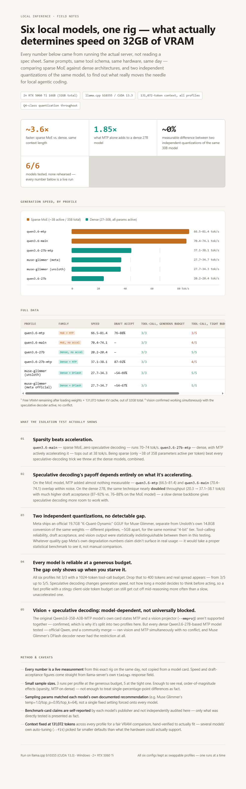
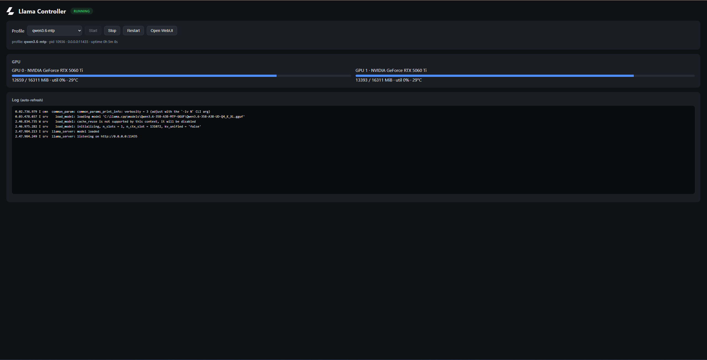
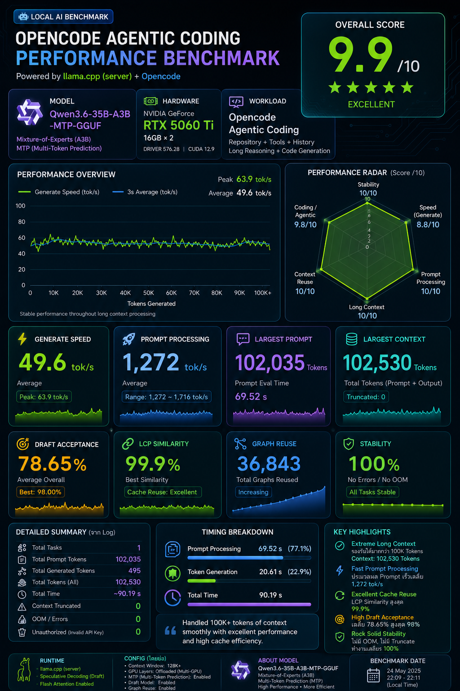
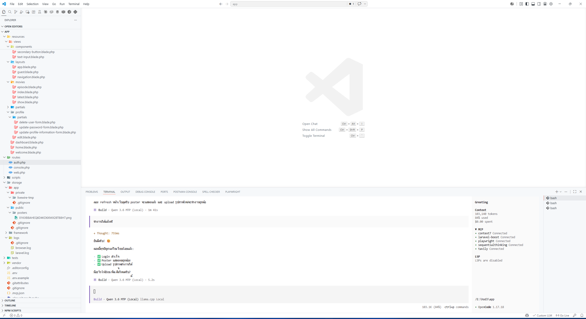
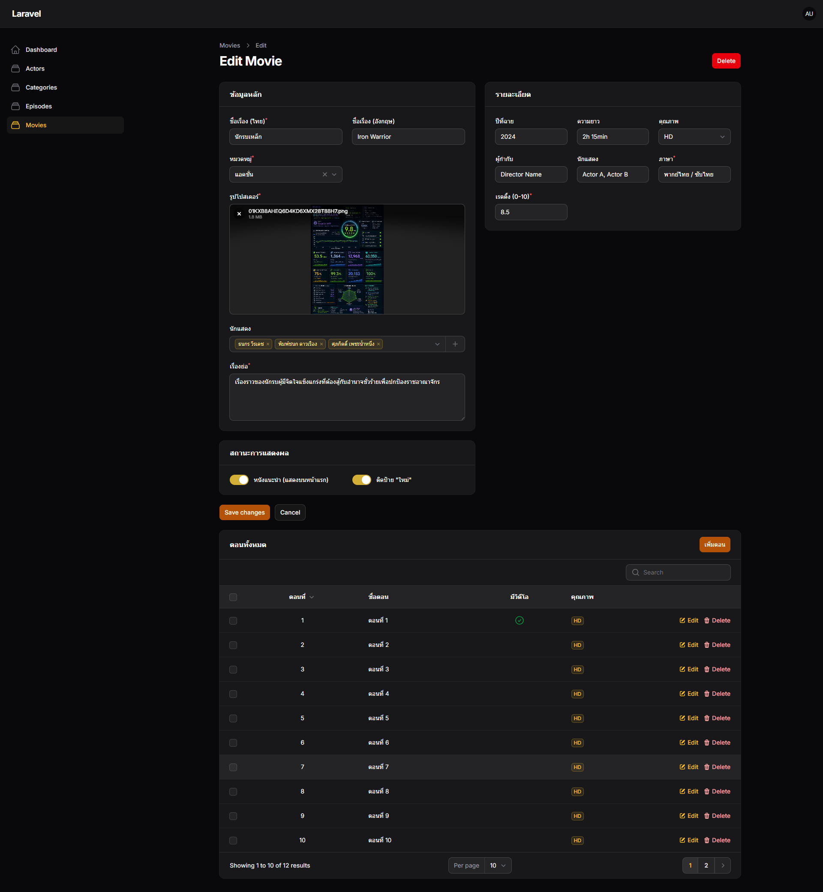
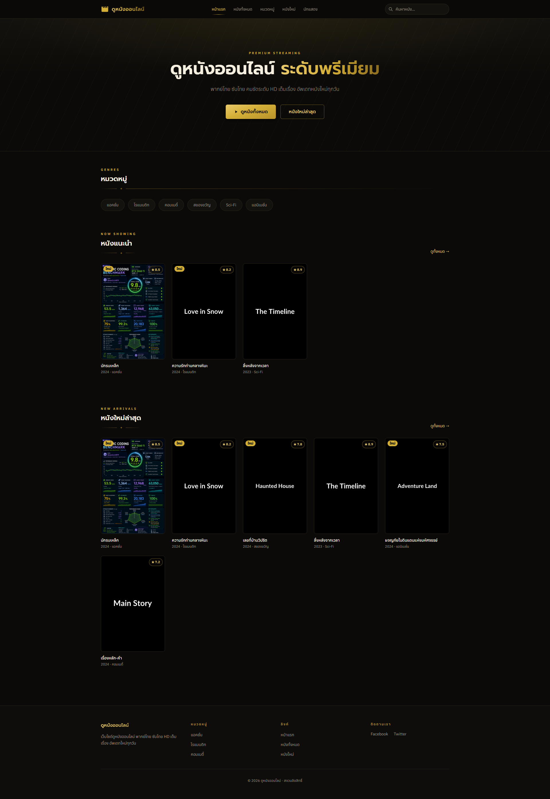
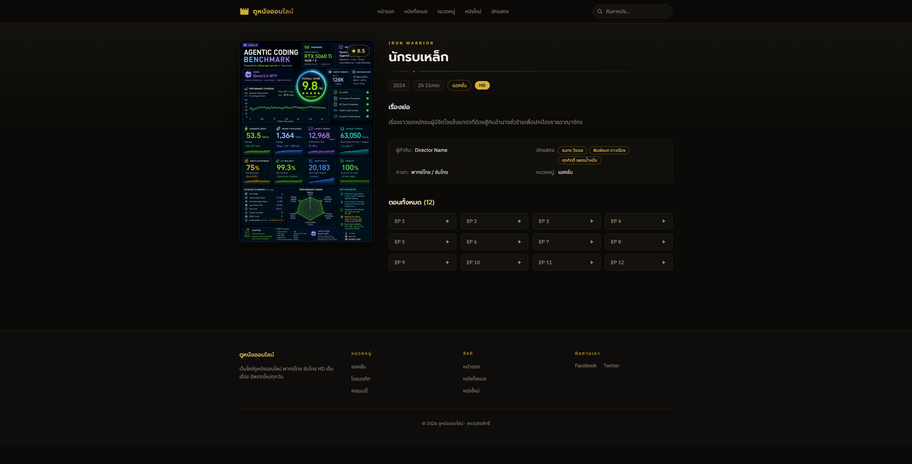

# Llama Controller

A local control panel for `llama-server.exe` (llama.cpp) so you don't have to
open a terminal and retype the launch command every time. One always-on
background "control server" manages the actual model process; you talk to it
via a CLI command (`llama ...`), a web dashboard, or a system tray icon.

This copy is tuned specifically for **agentic coding** (opencode, Zed, Cline,
GitHub Copilot Chat, Open WebUI) against a local Qwen3.6-35B-A3B model on
2x RTX 5060 Ti (16GB each). Claude Code is deliberately not wired up — see
below.

Dashboard icon (`public/icon-dark.svg`) is the official llama.cpp mark from
[ggml-org/llama.brand](https://github.com/ggml-org/llama.brand), licensed
CC BY-NC 4.0 — used here under attribution, non-commercial personal project.

📊 [`docs/benchmark-report.html`](docs/benchmark-report.html) — a formatted
write-up of the 6-model MoE-vs-dense comparison below (open it in a browser
for the live version — GitHub strips the `<style>` that makes it look like
this; the image below is a screenshot for that reason):

<a href="docs/benchmark-report.html"></a>

## In action

The dashboard, mid-session:



Benchmark run through opencode against this exact tuned setup:



**9.9/10 overall** — 49.6 tok/s average generate speed (peak 63.9), 78.65%
average MTP draft acceptance, 99.9% cache/LCP similarity, **100% stability**
(zero OOM, zero errors) across a 102,530-token session with no context
truncation.

A real project built end-to-end through opencode in VS Code against this
model — a Laravel movie-streaming site (admin panel + public frontend):



<table>
<tr>
<td></td>
<td></td>
<td></td>
</tr>
<tr>
<td align="center">Admin backend</td>
<td align="center">Public homepage</td>
<td align="center">Movie detail page</td>
</tr>
</table>

## Layout

- `config.json` — model profiles (path, port, context size, GPU layers, sampling, etc.)
- `server.js` + `lib/` — the control server (Node, no npm install needed). Runs
  on `http://0.0.0.0:4570`. Starts/stops/restarts `llama-server.exe`, tails its
  log, and reports GPU usage.
- `public/` — the web dashboard served by the control server.
- `cli/llama.ps1` / `cli/llama.cmd` — the `llama` command. Auto-starts the
  control server if it isn't already running.
- `tray/tray.ps1` — system tray icon (Start/Stop/Restart/Open, per-profile menu).
- `scripts/install.ps1` — adds `cli\` to your PATH and makes the tray icon
  launch automatically at login.

This repo is only the wrapper — the actual llama.cpp build and model files it
drives live outside it, at whatever `llamaDir`/`modelsDir` point to in
`config.json` (`C:\llama.cpp` on this machine):

```
C:\llama.cpp
├── llama-server.exe          <- the binary this wrapper actually launches
├── llama-cli.exe, llama-quantize.exe, llama-bench.exe, ...   (other llama.cpp tools, unused by this wrapper)
├── ggml-*.dll, llama*.dll, cublas64_13.dll, cudart64_13.dll  (CUDA/CPU backend libraries llama-server.exe needs alongside it)
└── models\
    ├── Qwen3.6-35B-A3B-UD-Q4_K_XL.gguf              <- "qwen3.6-main" profile
    ├── mmproj-Qwen3.6-35B-A3B-F16.gguf              <- vision projector for "qwen3.6-main" only
    ├── qwen36-a3b-claude-coder-q4_K_M.gguf          <- "qwen3.6-coder" profile (broken, see below)
    ├── Qwen3.6-35B-A3B-MTP-GGUF\
    │   └── Qwen3.6-35B-A3B-UD-Q4_K_XL.gguf          <- "qwen3.6-mtp" profile (default)
    ├── Qwen3.6-27B-Fable-Fusion-711-MTP-GGUF\
    │   ├── Qwen3.6-27B-Fable-Fus-711-MTP-Q6_K.gguf  <- "fable-fusion-27b" profile (tested, not default - see below)
    │   └── mmproj-Fable-Fusion-711-F16.gguf         <- vision projector for "fable-fusion-27b"
    ├── Muse-Glimmer-30B-GGUF\
    │   ├── Muse-Glimmer-30B-UD-Q4_K_XL.gguf         <- "muse-glimmer-30b" profile - Unsloth's own GGUF conversion (~14.8GB)
    │   ├── dflash-kquant.gguf                       <- DFlash drafter - shared by both muse-glimmer-30b profiles
    │   └── mmproj-kquant.gguf                       <- vision projector - shared by both muse-glimmer-30b profiles
    ├── Muse-Glimmer-30B-Meta-GGUF\
    │   └── muse-glimmer-30B-kquant-dynamic.gguf     <- "muse-glimmer-30b-meta" profile - Meta's own official export (19.7GB)
    ├── Qwen3.6-27B-GGUF\
    │   └── Qwen3.6-27B-UD-Q4_K_XL.gguf              <- "qwen3.6-27b" profile - plain dense, no MTP
    ├── Qwen3.6-27B-MTP-GGUF\
    │   └── Qwen3.6-27B-UD-Q4_K_XL.gguf              <- "qwen3.6-27b-mtp" profile - plain dense + MTP
    └── Qwen3.8-27B-GGUF\
        ├── Qwen3.8-27B-UD-Q5_K_XL.gguf              <- "qwen3.8-27b" AND "qwen3.8-27b-mtp" profiles (same file, MTP head baked in)
        └── mmproj-F16.gguf                          <- vision projector, shared by both qwen3.8-27b profiles
```

Each profile's `"model"` field in `config.json` is a path relative to
`modelsDir` — e.g. `qwen3.6-mtp`'s is
`Qwen3.6-35B-A3B-MTP-GGUF/Qwen3.6-35B-A3B-UD-Q4_K_XL.gguf`, which resolves to
`C:\llama.cpp\models\Qwen3.6-35B-A3B-MTP-GGUF\Qwen3.6-35B-A3B-UD-Q4_K_XL.gguf`.
This wrapper never touches anything under `C:\llama.cpp` except to spawn
`llama-server.exe` (cwd set there so it finds its own DLLs) and read `.gguf`
files — no writes, no updates to the llama.cpp install itself.

### Upgrading llama.cpp itself

Currently on **build 10448** (`ad1de39e0`), upgraded from b9949 -> b10155 ->
b10355 -> b10430 -> b10448. There's no
auto-updater — llama.cpp ships as a plain zip of binaries. The process,
in case it needs repeating:

1. `llama stop` first — the exe/dlls are locked while running.
2. Find the latest release with populated assets at
   [github.com/ggml-org/llama.cpp/releases](https://github.com/ggml-org/llama.cpp/releases)
   — the very newest tag sometimes has 0 assets for a while if its build/upload
   is still in progress; use the one just before it if so.
3. Download **both** `llama-b<N>-bin-win-cuda-<X.X>-x64.zip` (the binaries)
   and `cudart-llama-bin-win-cuda-<X.X>-x64.zip` (CUDA runtime DLLs) matching
   the CUDA version your driver reports (`nvidia-smi` header, "CUDA Version") —
   13.3 here.
4. Back up first: move the current `*.exe`/`*.dll` files (not `models\`) into
   a dated subfolder like `_backup-b<old>\`, so there's an instant rollback if
   the new build regresses something.
5. Extract both zips into `C:\llama.cpp` (they unpack flat into the root, no
   nested folder).
6. Re-verify everything this README claims still holds — flags can be
   renamed/removed across versions. At minimum: `llama-server --help` for
   every custom flag in `config.json`'s `extraArgs`, then actually load each
   profile and re-test tool-calling + streaming + (for `qwen3.6-main`) vision,
   not just that the process starts. Don't trust a version bump silently.

A new upgrade isn't just routine maintenance — it's also required whenever a
new model's architecture is too recent for the installed build.
`muse-glimmer-30b` below failed with `unknown model architecture:
'muse-glimmer'` on b10155 simply because that model's llama.cpp support
(PR #26841) merged after b10155 was built. Check the target model's error
message for `unknown model architecture` before assuming something else is
wrong, and find the merge date on GitHub to pick a release published after it.

Upgrade history:
- **b9949 → b10155**: all custom flags (`--spec-type draft-mtp`,
  `--reasoning-budget`, `--no-reasoning-preserve`, `--api-key-file`,
  `--mmproj`, `--alias`) still present and working, tool-calling + streaming
  + vision all re-verified end-to-end, MTP draft acceptance still ~85-90%.
  `qwen3.6-coder` re-tested directly against the new build and still fails
  with the identical `rope.dimension_sections` error — confirms that's a
  permanent property of the file needing re-conversion, not a version
  window that happened to close.
- **b10155 → b10355** (to get `muse-glimmer-30b` loading at all): re-ran the
  `qwen3.6-mtp` tool-calling + MTP check first (72.3 tok/s, 75/90 draft
  accepted, unchanged) before trusting the new build for anything else.
- **b10355 → b10430**: routine catch-up (75 commits), but two fixes were
  directly relevant to this setup — `chat: tighten bare function parsing for
  Qwen models` (#26793, every Qwen3.6/3.8 profile here) and `chat: fix
  muse-glimmer detection of tool calls after EOM` (#26879, both
  `muse-glimmer-30b*` profiles). Re-verified `qwen3.6-mtp` (3/3 tool-calling,
  loads clean, no new warnings) and `muse-glimmer-30b` (4/4 tool-calling)
  before trusting the build for anything else. Also brought in `spec:
  auto-detect mtp draft model type` / `common: auto-detect spec type from
  draft GGUF metadata` (#27005, #26814) — didn't change any `extraArgs` here
  since explicit `--spec-type` still works and is clearer to read in
  `config.json`, but it's now optional going forward.
- **b10430 → b10448**: small catch-up (18 commits), the one directly
  relevant fix was `ggml: recurrent state rollback for ggml_ssm_scan`
  (#26623) — the exact op backing `qwen3.8-27b`/`qwen3.8-27b-mtp`'s Gated
  DeltaNet linear-attention layers. Re-tested both: tool-calling 3/3,
  vision still correct, speed unchanged (~17.2 tok/s, matching the ~16.85
  tok/s measured pre-upgrade) — no regression. Also updated `cpp-httplib`
  and `BoringSSL` (server's HTTP/TLS stack, worth noting since this server
  is bound to `0.0.0.0` on the LAN) and migrated the deprecated
  `--mmap`/`--no-mmap` flags to `--load-mode` internally (not used in any
  profile here, no `extraArgs` change needed).

## Everyday commands (from any cmd.exe or PowerShell window)

```
llama start [profile]     start a model (defaults to config.json's defaultProfile)
llama stop                stop whatever is running
llama restart [profile]   stop + start (same profile if none given)
llama status              running? which profile/pid/port, GPU usage
llama logs [n]            last n lines of the current model's log (default 100)
llama profiles            list configured profiles
llama open                open the web dashboard in your browser
```

The first call to any `llama` command auto-starts the control server (hidden,
no console window) if it isn't already running. Web dashboard:
`llama open`, or browse to `http://localhost:4570`. Tray icon: right-click for
Start/Stop/Restart/Open; starts automatically after `scripts\install.ps1`, or
run manually with `powershell -WindowStyle Hidden -File tray\tray.ps1`.

---

## The model: Qwen3.6-35B-A3B-MTP

Read directly from the GGUF header and cross-checked against the
[official Unsloth model card](https://huggingface.co/unsloth/Qwen3.6-35B-A3B-MTP-GGUF):

- **Architecture**: hybrid — 10 blocks of `3x (Gated DeltaNet -> MoE) + 1x (Gated Attention -> MoE)`,
  i.e. only 1 layer in 4 is full attention; the rest is Gated DeltaNet, a
  linear-attention/SSM-family method. This is why KV cache barely grows as
  context size increases (verified: 4k -> 128k context only cost a couple GB
  of extra VRAM).
- **MoE**: 256 experts, 8 routed + 1 shared active per token (~3B active
  params of 35B total — the "A3B" name).
- **Native trained context: 262,144 tokens**, extensible to ~1M via YaRN if
  ever needed. Our 131072 (128k) setting is well inside the native range —
  no extrapolation, no quality tax.
- **MTP (multi-token-prediction) head**: this specific `-MTP-GGUF` file has
  20 extra tensors (753 vs 733 in the plain variant) implementing a next-token
  draft head for self-speculative decoding. **Confirmed live**: a streamed
  request showed `draft_n: 106, draft_n_accepted: 96` (~90% acceptance) — this
  is a real, working speedup, not just a filename.
- **Sampling defaults are embedded in the GGUF itself** (`general.sampling.*`
  keys) by the model author, not llama.cpp fallbacks — confirmed by diffing
  against llama-server's actual hardcoded defaults, which differ.
- Tool calling / reasoning capabilities (from `/props`):
  `supports_tools`, `supports_tool_calls`, `supports_parallel_tool_calls`,
  `supports_preserve_reasoning` all `true`.

The plain `qwen3.6-main` profile is the same base model **without** the MTP
head (733 tensors) — `--spec-type draft-mtp` only works on the `-MTP-GGUF`
file and is not set on that profile.

**`qwen3.6-main` has vision, `qwen3.6-mtp` deliberately doesn't.** Added
`--mmproj models\mmproj-Qwen3.6-35B-A3B-F16.gguf` (downloaded separately from
[unsloth/Qwen3.6-35B-A3B-GGUF](https://huggingface.co/unsloth/Qwen3.6-35B-A3B-GGUF),
~858 MiB — llama.cpp vision support needs this separate CLIP-projector file
alongside the main text model) to the `qwen3.6-main` profile only. Verified
end-to-end: generated a test image (blue circle on white), sent it through
`/v1/chat/completions` as an `image_url` data URI, got back "A blue circle."
— `/props` now reports `modalities: {vision: true, video: true}` for this
profile. VRAM cost was small (~26GB total across both cards afterward, still
comfortable headroom). **Not added to `qwen3.6-mtp`** because the model card
explicitly states MTP speculative decoding and `--mmproj` aren't supported
together — pick vision (`qwen3.6-main`) or the MTP speedup (`qwen3.6-mtp`),
not both, per profile.

## Tuning applied for agentic coding, and why

The flags below were added to `extraArgs` after finding a real,
reproducible problem: at the model's default embedded `temp=1.0`, the same
tool-calling prompt sent 3x sometimes finished in ~150 tokens of reasoning and
sometimes blew past 200+ tokens without ever emitting the tool call
(`finish_reason: "length"`, no `tool_calls` in the response at all). That's a
silent, intermittent failure for any agentic client with a modest
`max_tokens` setting.

| Flag | Why |
|---|---|
| `--reasoning-budget 2048` | Hard cap on thinking-token length so a response (and any tool call) is reached well before typical client `max_tokens` budgets. Verified: 4/4 successful tool calls at a realistic 1024-token client budget after this + the temp change below (down from intermittent failures before). |
| `--no-reasoning-preserve` | Agent sessions run many turns. Without this, every turn re-sends the full `<think>` trace of every prior turn, burning through the 128k context fast. Only the latest turn's reasoning is kept. |
| ~~`--cache-reuse 256`~~ | **Tried, doesn't apply here — removed.** Intended to let llama.cpp reuse a matching KV-cache chunk when something earlier in the conversation changed. Every single startup log showed `W cache_reuse is not supported by this context, it will be disabled` — this model's hybrid Gated DeltaNet/SSM layers don't have a shiftable KV cache the way pure-attention models do, so the flag was silently a no-op the entire time it was set. Caught by actually reading the full startup log (including warnings, not just errors) instead of only checking for a clean listen. |
| `--spec-type draft-mtp --spec-draft-n-max 2` (mtp profile only) | Activates the model's built-in MTP draft head — this is the official flag from the model card, without which the extra MTP tensors just sit unused. Confirmed working (~90% draft acceptance, ~74 tok/s vs ~60-66 tok/s baseline). Requires `--parallel 1` (`-np 1`), already set — the model card notes MTP does not support `-np > 1`. |
| `--temp 0.6 --top-p 0.95 --top-k 20 --min-p 0 --presence-penalty 0.0` | The model card gives **different** recommended sampling for "thinking mode - coding" (temp 0.6) vs "thinking mode - general" (temp 1.0, the embedded default). Since this box is used for coding, switched to the coding-specific recommendation. This is also what fixed the reasoning-length variance above — lower temperature made reaching the tool call far more consistent. |
| `--alias <profile-name>` | Without it, the model's `id` in `/v1/models` is the full Windows file path (`C:\llama.cpp\models\...gguf`), which is awkward/fragile to put in client configs. Now each profile reports a clean id: `qwen3.6-mtp`, `qwen3.6-main`, `qwen3.6-coder`. |
| `--api-key-file secrets\llama-api-key.txt` | Required auth for every client, generated once with `node -e "console.log(require('crypto').randomBytes(32).toString('hex'))"`. The file lives outside `config.json`/git (see `.gitignore`) — the flag only points at a path, never the secret itself, so the repo stays safe to push. Verified: no/wrong key -> `HTTP 401`, correct key -> `HTTP 200`. |

`qwen3.6-coder` (`qwen36-a3b-claude-coder-q4_K_M.gguf`) is marked `"broken": true`
in `config.json` — it fails to load on the installed llama-server build with
`error loading model hyperparameters: key qwen35moe.rope.dimension_sections
has wrong array length; expected 4, got 3`. That file was converted with an
**older** llama.cpp conversion script (3-section RoPE) than what this build
expects (4-section). Fix: re-convert it from the original checkpoint with the
current `convert_hf_to_gguf.py` — an older llama-server build won't help since
the file itself needs re-converting, not the runtime.

## Alternative model tried: Fable-Fusion-711 (tested, not adopted for coding)

Tried [DavidAU/Qwen3.6-27B-Fable-Fusion-711-Uncensored-Heretic-...-MTP-GGUF](https://huggingface.co/DavidAU/Qwen3.6-27B-Fable-Fusion-711-Uncensored-Heretic-NM-DAU-NEO-MAX-MTP-GGUF)
(Q6_K, `fable-fusion-27b` profile) out of curiosity. Not an official Qwen
release — a community merge/fine-tune stack plus an abliteration pass
("Heretic") that strips refusal behavior (99/100 refusals -> 4/100 per the
model card's own testing). Benchmark claims on the card (ARC-C/ARC-E/BoolQ,
self-reported, not independently verified) are general-reasoning scores with
**no coding-specific benchmark at all**, so they say nothing about fitness
for this setup's actual use case.

What testing actually found:
- **Base architecture is dense 27B**, not the sparse MoE the other profiles
  use — every token exercises all 27B params, no ~3B-active shortcut.
- Tool-calling works correctly (stream + non-stream, 3/3 runs), MTP draft
  acceptance is decent (~78-86%).
- **But raw speed is only ~26 tok/s vs ~74 tok/s** on `qwen3.6-mtp` — being
  dense costs far more per token than being sparse, even at a smaller total
  parameter count. This is the actual reason it's not the better choice,
  not the "uncensored" framing.
- `--fit` auto-picked only 8192 ctx (too conservative to be useful) because
  standard dense attention has real per-token KV cost, unlike the hybrid
  DeltaNet/SSM architecture the other models use. Tested by hand instead:
  65536 fits with solid headroom (~4.8GB free); 98304 triggered an actual
  CUDA OOM once during buffer allocation (auto-recovered by retrying without
  pipeline parallelism, but left under 800MB free on one card) — not a safe
  setting. Pinned `ctxSize: 65536` in `config.json` rather than trusting
  either extreme.
**Verdict**: works, but roughly 3x slower for agentic coding with a smaller
safe context ceiling than the default setup, in exchange for uncensored
output the coding use case doesn't need. Left configured as a profile,
`qwen3.6-mtp` stays default for coding.

**Now actually in use for Open WebUI chat + custom Tools** (data
fetch/analysis, not coding — the speed difference matters far less for
occasional Q&A than for rapid-fire agentic loops). Before trusting it for
that: stress-tested tool-calling at this model's default `temp=1.0` with a
tight 400-token budget, 5/5 succeeded — unlike `qwen3.6-mtp`, which had real
failures at temp=1.0 before being lowered to 0.6, this model didn't need a
temperature override. Added `--reasoning-budget`/`--no-reasoning-preserve`
anyway as cheap insurance for long chat sessions.

**Vision added afterward, with a genuine surprise**: the original Unsloth
`qwen3.6-mtp` model's card explicitly says MTP speculative decoding and
`--mmproj` aren't supported together (why `qwen3.6-main`/`qwen3.6-mtp` are
split into separate profiles above). This DavidAU merge has no such
restriction — loaded `--spec-type draft-mtp` and `--mmproj` at the same
time with zero conflict. Verified: the test image was correctly described
as "a blue circle" **and** MTP draft acceptance stayed ~82% in the same
request. VRAM got tighter (~28.5GB/32GB used, ~3.8GB free) but stable.

Only downside of switching to this profile: **this hardware runs one model
at a time**. While `fable-fusion-27b` is loaded for Open WebUI, it isn't
available to opencode/Zed/Cline/Copilot — switch back with
`llama restart qwen3.6-mtp` before coding again.

## Alternative model tried: Muse Glimmer-30B (tested, not adopted)

Tried [unsloth/Muse-Glimmer-30B-GGUF](https://huggingface.co/unsloth/Muse-Glimmer-30B-GGUF)
(`UD-Q4_K_XL`, `muse-glimmer-30b` profile). Unlike Fable-Fusion, this one is
a genuine **official release from Meta Superintelligence Lab** (confirmed
via the HF API `base_model` tag pointing at `meta-models/Muse-Glimmer-30B`,
not a community merge) — dense 29.6B with a dedicated ViT-G/14 perception
encoder, purpose-built for local agentic tasks, and its card explicitly
names OpenClaw as a supported scaffold.

**Needed a llama.cpp upgrade just to load** — b10155 didn't recognize the
`muse-glimmer` architecture at all (`unknown model architecture:
'muse-glimmer'`). Checked GitHub: support merged 2026-08-10 (PR #26841),
one day after our then-current build. Upgraded to b10355 (see "Upgrading
llama.cpp" above) — first real case of "the model is too new for the
installed build" as a reason to upgrade, distinct from routine maintenance.

Uses **DFlash speculative decoding** instead of MTP — a separate drafter
file (`dflash-kquant.gguf`, ~1.5 GiB) paired via `--spec-draft-model`,
predicting blocks of 16 tokens at once rather than MTP's per-token draft
head. Reasoning depth is controlled by a `Reasoning strength: <level>` line
in the system prompt rather than a CLI flag.

What testing actually found:
- Tool-calling reliable: 8/8 across two batches (including a tight
  400-token stress test at the card's own `temp=1.0`) — no reasoning-runaway
  issue like `qwen3.6-mtp` had before its temp was lowered.
- Vision works — `--mmproj` loads fine alongside `--spec-type draft-dflash`
  with no conflict (same pleasant surprise as Fable-Fusion had with MTP).
  Verified: test image correctly described as "a blue circle."
- **But raw speed is only ~30-34 tok/s** — slower than `qwen3.6-mtp`'s
  ~72-74 tok/s, and nowhere near the model card's claimed **3.1x speedup /
  233 tok/s**. That number was measured on an **RTX 5090**, a much more
  capable single card than this RTX 5060 Ti x2 setup — the marketing
  benchmark simply doesn't transfer to this hardware class. This is the
  clearest lesson from this whole evaluation: speculative-decoding speedup
  claims are hardware-specific and must be measured locally, not assumed
  from a vendor's benchmark GPU.
- `--fit` again auto-picked a too-small ctx (8192) despite ~12GB VRAM being
  free. Tested by hand: **131072 fits with ~10.3GB headroom to spare** —
  much cheaper than Fable-Fusion's dense attention because only 1 layer in
  4 is "Global" attention here, the rest are 2048-token sliding-window
  local layers (bounded KV cost regardless of total context).
- Model card's own benchmark table compares against Qwen3.6-27B specifically
  (not the 35B-A3B-MoE this setup runs day to day), with mixed results —
  ahead on agentic/tool benchmarks like MCP Atlas, behind on coding-specific
  ones like TerminalBench 2.1, OSWorld-Verified, and SWE-Bench Verified.

**Verdict**: loads and works correctly, tool-calling and vision both solid,
but not faster than the current setup on this hardware despite the
headline speculative-decoding claim. Kept as a profile in case its
purpose-built agentic design (failure recovery, native reasoning-strength
control) is worth it for a specific task, but `qwen3.6-mtp` stays default.

### Unsloth's GGUF vs Meta's own official GGUF: tested head-to-head

The `muse-glimmer-30b` profile above uses **Unsloth's own independent GGUF
conversion** (`UD-Q4_K_XL`, ~14.8GB). Digging into the model card's
"K-Quant-Dynamic / 0.2% degradation / 32GB VRAM" claim, neither Unsloth's
docs nor Meta's own model card (`meta-models/Muse-Glimmer-30B`) explicitly
names which file that refers to — so we checked Meta's *separate* official
GGUF repo, [meta-models/Muse-Glimmer-30B-GGUF](https://huggingface.co/meta-models/Muse-Glimmer-30B-GGUF).
It has a file literally named `muse-glimmer-30B-kquant-dynamic.gguf`
(19.7GB) — a different, larger quantization than Unsloth's, confirmed by
filename and exact byte-size match against the repo listing. **This is the
actual file Meta's 0.2% number was measured against**, not the one in the
`muse-glimmer-30b` profile.

Added it as `muse-glimmer-30b-meta` (reusing the same `dflash-kquant.gguf`/
`mmproj-kquant.gguf` — verified byte-identical between both repos before
downloading only the ~18.3GB text model) and ran the identical test battery
head-to-head against Unsloth's version:

| | Unsloth `UD-Q4_K_XL` (~14.8GB) | Meta official `kquant-dynamic` (19.7GB) |
|---|---|---|
| Tool-calling (tight-budget stress test) | 5/5 | 5/5 |
| Speed (DFlash active) | 27.7-34.3 tok/s | 27.7-34.7 tok/s |
| Draft acceptance | ~54-69% | ~54-67% |
| Vision test | "a blue circle" (correct) | "a blue circle" (correct) |
| 131072 ctx headroom | ~10.3GB free | ~6.8GB free (bigger weights) |

**No measurable difference** in tool-calling reliability, speed, or vision
correctness between the two quantizations in this setup's actual usage —
despite one being ~5GB larger and Meta's own validated 0.2%-degradation
number applying only to the larger one. Whatever quality gap that 0.2%
represents didn't surface in tool-calling/vision/speed testing; it would
need a real statistical benchmark (MMLU-style, many samples) to detect, not
casual manual comparison — both profiles are kept, `qwen3.6-mtp` still
stays default for coding either way.

### Two more added for a clean isolation test: plain Qwen3.6-27B, with and without MTP

The Muse Glimmer card's benchmark table compares against "Qwen3.6-27B
Thinking Mode" — a model this setup never actually had (Fable-Fusion is a
27B-based uncensored *merge*, not the pristine original). Added the real
thing from Unsloth: [Qwen3.6-27B-GGUF](https://huggingface.co/unsloth/Qwen3.6-27B-GGUF)
(`qwen3.6-27b`, no MTP) and [Qwen3.6-27B-MTP-GGUF](https://huggingface.co/unsloth/Qwen3.6-27B-MTP-GGUF)
(`qwen3.6-27b-mtp`) — same `UD-Q4_K_XL` quant, same sampling settings as
the other qwen3.6-* profiles for direct comparability. This also gives a
clean **A/B isolation of what MTP alone is worth**, same base model, only
difference is the MTP head.

### Full comparison (all 6 profiles, tested the same way, same day)

| | qwen3.6-mtp | qwen3.6-main | qwen3.6-27b | qwen3.6-27b-mtp | muse-glimmer (Unsloth) | muse-glimmer (Meta) |
|---|---|---|---|---|---|---|
| Params | 35B MoE (~3B active) | 35B MoE (~3B active) | 27B dense | 27B dense | 29.6B dense | 29.6B dense |
| Speculative decoding | MTP | none | none | MTP | DFlash | DFlash |
| Speed (1024-budget) | 66.5-81.4 tok/s | 70.4-74.1 tok/s | **20.2-20.4 tok/s** | 37.1-38.1 tok/s | 27.7-34.3 tok/s | 27.7-34.7 tok/s |
| Draft acceptance | 76-88% | n/a | n/a | **87-92%** | ~54-69% | ~54-67% |
| Tool-calling (1024 budget, 3 runs each) | 3/3 | 3/3 | 3/3 | 3/3 | 3/3 | 3/3 |
| Tool-calling (tight 400 budget, 5 runs each) | 3/5 | 4/5 | **5/5** | 4/5 | 5/5 | 5/5 |
| Vision | no | yes | yes | yes (+MTP, 81% acceptance, no conflict) | yes | yes |
| VRAM headroom @131072 ctx | ~5.5GB | ~6.2GB | ~8.2GB | ~6.4GB | ~10.3GB | ~6.8GB |

**What this isolation test actually shows:**
- **MoE vs dense is the dominant speed factor, not MTP.** `qwen3.6-main`
  (MoE, zero acceleration) at 70-74 tok/s is already faster than
  `qwen3.6-27b-mtp` (dense, *with* MTP acceleration) at 37-38 tok/s. Being
  sparse matters more than any speculative-decoding trick on top of dense.
- **MTP's value depends heavily on the baseline it's accelerating.** On the
  already-fast MoE model, MTP added almost nothing measurable (66-81 vs
  70-74 tok/s — within noise). On the slow dense model, MTP nearly
  **doubled** throughput (20.3 -> 37.1-38.1 tok/s, a genuine ~1.85x) with
  much higher draft acceptance (87-92% vs 76-88% on the MoE model) — dense
  backbones apparently make for a more predictable MTP draft target.
- **The plain dense Qwen3.6-27B (no acceleration) was the most reliable at
  the tight 400-token budget (5/5)**, better than every accelerated
  profile including its own MTP variant (4/5). Speculative decoding
  changes generation *speed*, not how many tokens the model decides to
  spend reasoning before it acts — but this run's numbers suggest it isn't
  fully neutral to reliability either; sample size here is small (5 runs)
  and this specific ranking shouldn't be over-read.
- **MTP + vision coexist on `qwen3.6-27b-mtp` too** (81% draft acceptance
  in the same vision request, no conflict) — the same pleasant surprise as
  Fable-Fusion. Only the original 35B-A3B `qwen3.6-mtp` documents the
  two as incompatible; every dense Qwen3.6-27B-based MTP variant tested
  here (official and community merge alike) handles both together fine.

### A newer generation added: Qwen3.8-27B, with and without MTP

Added [Qwen3.8-27B-GGUF](https://huggingface.co/unsloth/Qwen3.8-27B-GGUF) —
a newer Qwen point release than everything above (architecture foundation is
Qwen3.5, not Qwen3.6), built on a hybrid **Gated DeltaNet + Gated Attention**
design: only 16 of its 64 layers carry a real KV cache, the rest use a cheap
recurrent linear-attention state, conceptually similar to Muse Glimmer's
sliding-window memory savings. Native context is 262,144 (extensible to 1M
via YaRN).

First tried `UD-Q6_K_XL` (25.9GB) for the higher-precision tier. **`--fit`
couldn't help pick a context size** (`n_gpu_layers already set by user to
999, abort`), and 131072 ctx — which every other 27B profile above fits
fine — hit a hard CUDA OOM allocating the vision projector buffer at that
quant. It only loaded at 65536, the tightest headroom of any profile in
this setup (~1.3-2.4GB free per GPU). Since full 131072 context matters
more here than the extra bit of precision, worked out from that failure's
memory math which smaller quant would still fit at full context without
giving up more capability than necessary, and re-tested with `UD-Q5_K_XL`
(20.2GB) — confirmed to load cleanly at the full 131072 with 2.1-3.5GB free
per GPU, and as a bonus it's also *faster* than the Q6 attempt (less
compute per token at a lighter quant). All numbers below are from this
final Q5_K_XL/131072 configuration.

A genuine surprise while reading the startup log: this GGUF's tensor list
includes `blk.64.nextn.*` (MTP head) tensors that are silently ignored
without `--spec-type` — **MTP is baked into the same file**, unlike
Qwen3.6-27B, which needed a separately-published `-MTP-GGUF` repo. That
made a `qwen3.8-27b-mtp` profile free to add — same file, one extra flag,
no additional download.

| | qwen3.8-27b | qwen3.8-27b-mtp |
|---|---|---|
| Params | 27B dense (hybrid DeltaNet/Attention) | 27B dense (hybrid DeltaNet/Attention) |
| Quant | UD-Q5_K_XL (20.2GB) | UD-Q5_K_XL (20.2GB, same file) |
| Speculative decoding | none | MTP |
| Speed | ~16.85 tok/s | ~28-30 tok/s (~1.7x) |
| Draft acceptance | n/a | 77-79% (mean accepted run length ~2.5-2.6) |
| Tool-calling (1024 budget, 3 runs) | 3/3 | 3/3 |
| Tool-calling (tight 400 budget, 5 runs) | 5/5 | not separately stress-tested (3/3 at 400 budget) |
| Vision | yes | yes (no conflict with MTP) |
| ctxSize | 131072 | 131072 |
| VRAM headroom | ~2.1-3.5GB per GPU | ~1.8-2.1GB per GPU |

**What this one shows:**
- **Slower than plain `qwen3.6-27b` despite being a newer generation.**
  ~16.85 vs ~20.3 tok/s unaccelerated — this model's own heavier per-token
  cost (partly offset here by dropping from Q6 to Q5) outweighs any
  generational improvement on raw throughput; this isn't a clean
  apples-to-apples quant comparison against the 3.6 numbers either way.
- **Lighter quant was a net win on every axis, not just a size/speed
  tradeoff.** Q5_K_XL over Q6_K_XL fit the full context Q6 couldn't, ran
  faster (~16.85 vs ~13.8 tok/s unaccelerated), and even came out with
  *better* MTP draft acceptance (77-79% vs 72%) — no measurable downside
  found in this setup's casual testing.
- **MTP's payoff here (~1.7x) lines up with `qwen3.6-27b-mtp`'s (1.85x)** —
  further evidence that on this hardware, MTP reliably buys dense models
  roughly a 1.7-1.85x speedup regardless of exact architecture, while MoE
  sparsity remains the bigger lever (`qwen3.6-mtp` still leads at ~74 tok/s).
- **Tool-calling improvements the model card advertises** ("parsing nested
  objects to make tool calling succeed more") held up in practice — 8/8
  across both budget levels on the non-MTP profile.
- Reinforces the emerging pattern that **MTP-and-vision-together is the
  norm for dense Qwen-derived models on this build**, not the exception —
  every dense profile tested so far (Fable-Fusion, `qwen3.6-27b-mtp`, now
  `qwen3.8-27b-mtp`) handles both simultaneously with no conflict.

## Streaming + tool calls: verified working on this build

Some llama.cpp versions have had bugs combining `stream: true` with `tools`
(malformed `tool_calls[].function.arguments`, or outright errors — see
[llama.cpp #20198](https://github.com/ggml-org/llama.cpp/issues/20198)). This
matters because several clients below stream by default. **Verified directly
against this build (b10430)**: streamed tool calls come back as correct
incremental JSON string deltas that concatenate into valid arguments, with a
correct final `finish_reason: "tool_calls"`. If you update llama.cpp later and
a client's tool use starts behaving oddly, this is the first thing to
re-check.

---

## Connecting your coding agents

Base URL for all of these: **`http://localhost:11435/v1`** (or
`http://<this-pc's-LAN-IP>:11435/v1` from another device — the server is
bound to `0.0.0.0`). Model id: **`qwen3.6-mtp`** (or `qwen3.6-main` if you
started that profile instead — check with `llama status`).

**API key is required** — llama-server is started with
`--api-key-file secrets\llama-api-key.txt` (generated once, gitignored, never
committed). Read the key with `type secrets\llama-api-key.txt` (cmd) or
`Get-Content secrets\llama-api-key.txt` (PowerShell) and paste it into each
client's API Key field below instead of a placeholder. Verified directly:
requests with no key or the wrong key get `HTTP 401`; only the real key gets
`HTTP 200`.

We deliberately chose **no proxy in front of llama-server** — connect every
client straight to `:11435`. A translation proxy (LiteLLM etc.) was
considered for gateway/external-access purposes and specifically to let
Claude Code talk to this model, but LiteLLM has open issues around dropping
`reasoning_content`/streamed `tool_calls` for custom OpenAI-compatible
backends — exactly the two things we spent the most effort getting reliable
directly against llama-server. Direct connection has zero such risk, so
**Claude Code is out of scope for this local model** (it can't speak
llama-server's OpenAI-shaped API without a translation layer of some kind);
the other five clients all speak OpenAI's format natively and connect
straight to llama-server with no compromises.

**Context/output token budget used throughout this section**: our `ctxSize`
is 131072. Several clients ask you to declare an input-token limit and an
output-token limit *separately*, and they must sum to no more than the total
context window. We use **122880 input + 8192 output = 131072** everywhere
that split is asked for — 8192 covers the `--reasoning-budget 2048` thinking
cap plus a generous ~6k for the actual answer/code, while leaving the bulk of
the window for input (file contents, tool defs, conversation history, which
matter more than output length for agentic coding). If you find outputs
getting cut off on big single-file generations, shift the split, e.g.
16384 output / 114688 input.

### opencode

Edit `~/.config/opencode/opencode.json` (global) or `opencode.json` in your
project root — uses the Vercel AI SDK's `@ai-sdk/openai-compatible` package
under the hood:

```json
{
  "$schema": "https://opencode.ai/config.json",
  "provider": {
    "local-llama": {
      "npm": "@ai-sdk/openai-compatible",
      "name": "llama.cpp Local",
      "options": {
        "baseURL": "http://localhost:11435/v1",
        "apiKey": "<paste key from secrets\\llama-api-key.txt>"
      },
      "models": {
        "qwen3.6-mtp": {
          "name": "Qwen 3.6 MTP (Local)",
          "limit": { "context": 122880, "output": 8192 }
        }
      }
    }
  },
  "model": "local-llama/qwen3.6-mtp"
}
```

`limit.context` is input tokens only, `limit.output` is separate — matches
the 122880/8192 split explained above. Restart opencode fully after editing
— providers aren't hot-reloaded. Switch models anytime with `/models` in the
TUI.

### Zed

Menu → Open Settings (or the Agent Panel's settings gear → "Add Provider").
Add to `settings.json`:

```json
{
  "language_models": {
    "openai_compatible": {
      "llama-cpp": {
        "api_url": "http://localhost:11435/v1",
        "available_models": [
          {
            "name": "qwen3.6-mtp",
            "display_name": "Local Qwen3.6-MTP",
            "max_tokens": 131072,
            "max_output_tokens": 8192,
            "capabilities": {
              "tools": true,
              "images": false,
              "parallel_tool_calls": false
            }
          }
        ]
      }
    }
  }
}
```

Note Zed's `max_tokens` means something different from opencode/Copilot's
input-only fields above — here it's the model's **total** context window, so
it's set to the full 131072, with `max_output_tokens` (8192) as a separate
additional cap on generation length, not subtracted from it.

Zed reads the API key from an **environment variable**, not the settings
file — derived from the provider key as `<PROVIDER_ID>_API_KEY` uppercased
(here: `LLAMA_CPP_API_KEY`). Set it to the real key from
`secrets\llama-api-key.txt` before launching Zed.
Then pick the model from the Agent Panel's model picker.

Known gotcha: some users report Zed hangs/"loading forever" after
hand-editing `settings.json` with a local `api_url` — if that happens, use
the UI "Add Provider" modal instead and restart Zed
([zed-industries/zed#58443](https://github.com/zed-industries/zed/issues/58443)).

### Cline (VS Code)

Settings gear → **API Provider: "OpenAI Compatible"**:
- **Base URL**: `http://localhost:11435/v1`
- **API Key**: the real key from `secrets\llama-api-key.txt`
- **Model ID**: `qwen3.6-mtp`
- **Context Window Size**: `131072`, **Max Output Tokens**: `8192` — set these
  manually, Cline doesn't reliably pick them up from `/v1/models` for local
  servers.

Known llama.cpp-side gotchas seen in the wild (not confirmed on this specific
build, see "verified working" note above, but worth knowing about if you
update llama.cpp later): malformed `tool_calls` arguments over streaming
([llama.cpp#20198](https://github.com/ggml-org/llama.cpp/issues/20198)), and
a report of the llama.cpp provider misbehaving specifically in Cline's CLI
mode ([cline#7079](https://github.com/cline/cline/issues/7079)).

### GitHub Copilot Chat (VS Code)

Supported via VS Code's BYOK "Custom Endpoint" model provider (stable as of
VS Code 1.122):

1. Command Palette → **"Chat: Manage Language Models"**.
2. **Add Models** → **Custom Endpoint**.
3. Name it (e.g. "llama.cpp Local"), API type **Chat Completions**.
4. Enter the real key from `secrets\llama-api-key.txt` when prompted.
5. VS Code opens `chatLanguageModels.json` to finish the entry — set:
   - `id`: `qwen3.6-mtp`
   - `url`: `http://localhost:11435/v1/chat/completions`
   - `toolCalling: true`
   - `maxInputTokens: 122880`, `maxOutputTokens: 8192` — VS Code's docs are
     explicit that these two **must sum to no more than the model's actual
     context window** (131072 here); setting them wrong misreports capacity
     to VS Code and breaks its context-usage display.
6. Select it from the Chat model picker.

**Caveat**: this only affects Copilot **Chat**. Inline ghost-text code
completions stay on GitHub's hosted models regardless — there's no way to
redirect those to a local model.

### Open WebUI

Admin Settings → **Connections** → Add Connection:
- **API Base URL**: `http://localhost:11435/v1`
- **Auth Type**: **Bearer** (not Session/OAuth/Entra ID — those forward
  Open WebUI's own login session/SSO identity to the backend, which
  llama-server doesn't understand; it only checks a static bearer token)
- **API Key**: the real key from `secrets\llama-api-key.txt`
- Click **Verify Connection**, then select a model from the list.

**For image uploads**: switch to the **`qwen3.6-main`** profile
(`llama restart qwen3.6-main`) — that's the one with the vision projector
loaded, not `qwen3.6-mtp`. Upload an image in the chat and ask about it like
normal; verified working (see "The model" section above).

Confirmed working end-to-end by the user.

### Claude Code — deliberately not supported here

Claude Code's `ANTHROPIC_BASE_URL` only accepts backends that speak the
**Anthropic Messages API format**; llama-server speaks **OpenAI**'s format —
a different shape, so it can't connect directly no matter how it's
configured. The only way to bridge them is a translation proxy (e.g. LiteLLM,
which exposes an Anthropic-compatible `/v1/messages` endpoint that translates
to an OpenAI-compatible backend) sitting in front of llama-server, with
`ANTHROPIC_BASE_URL` pointed at the proxy instead.

We evaluated this and decided against it **on purpose**: LiteLLM has open
upstream issues around dropping `reasoning_content` and streamed
`tool_calls` specifically for custom OpenAI-compatible backends — the exact
two things this whole setup was tuned to get right (reasoning-budget,
MTP speculative decoding, verified streaming+tool-calls). Adding a proxy
layer just for Claude Code would reintroduce risk we've already eliminated
for the other five clients, for the sake of one. So: **this local model is
not wired up for Claude Code**, by choice, not by ignorance of the option.
If that trade-off ever changes, the LiteLLM `config.yaml` needed is already
known (custom `model_list` entry, explicit `model_info` context/output
limits, `general_settings.master_key` for auth) — just not deployed.

---

## Network exposure

`llama-server.exe` (port 11435) now requires the API key in
`secrets\llama-api-key.txt` — verified: no key or a wrong key gets `HTTP 401`.

The **control server (port 4570) still has no authentication** — anyone who
can reach it can start/stop/restart/switch models on your machine. Both
still bind to `0.0.0.0` (LAN reachable) per your setup. Fine on a trusted
home LAN.

### Exposing this beyond your LAN

Evaluated, not deployed. Two common approaches for reaching this from
outside your home network:
- **Tailscale/ZeroTier (recommended)** — private VPN mesh, no port-forwarding,
  built-in TLS, only reachable from your own enrolled devices. Safest by
  far since nothing is actually public.
- **Cloudflare Tunnel** — gives a real public URL, usable from any device
  without installing a VPN client, but means the endpoint really is public.

Either way, keep the control server (4570) LAN-only/Tailscale-only even if
you expose the model port (11435) more broadly — its `--api-key-file` auth
protects the model API, but nothing protects the control server from someone
who can reach it.

## Adding/editing profiles

Each profile in `config.json`:

```json
"my-profile-name": {
  "model": "subfolder/model.gguf",
  "host": "0.0.0.0",
  "port": 11435,
  "ctxSize": 131072,
  "gpuLayers": 999,
  "parallel": 1,
  "flashAttn": "on",
  "cacheTypeK": "q8_0",
  "cacheTypeV": "q8_0",
  "extraArgs": "--alias my-name --any --other --llama-server --flags"
}
```

Only fields you set are passed as flags; anything omitted lets llama-server's
own `--fit` (on by default) auto-tune it to whatever VRAM is free. Changes
take effect on the next `llama start`/`llama restart` — a running model isn't
hot-reloaded.

## Troubleshooting

- `llama status` shows CRASHED → `llama logs 200` to see why the process died.
- "model file not found" on start → check the `model` path in `config.json`
  is correct relative to `modelsDir`.
- If `llama` isn't recognized after `install.ps1`, open a new terminal.
- A client's tool calls fail/hang intermittently → check its `max_tokens` is
  at least ~1024; below that, `--reasoning-budget 2048` doesn't help since
  the client's own limit is hit first.
- Client shows a huge/wrong context window → local servers don't always
  report `n_ctx` correctly via `/v1/models`; set it manually in the client
  to match `ctxSize` in `config.json` (131072).
